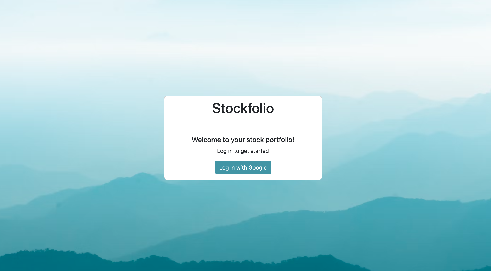
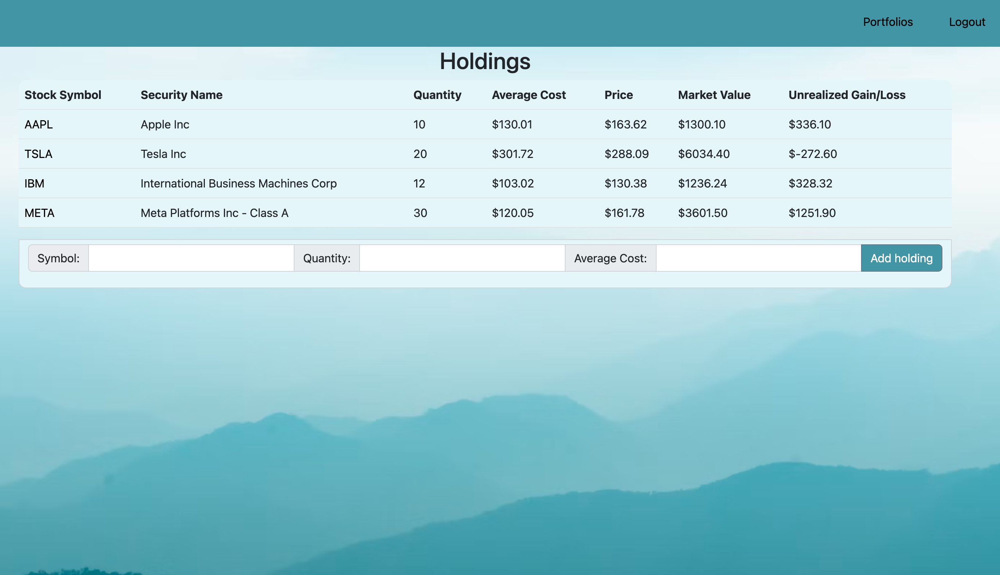
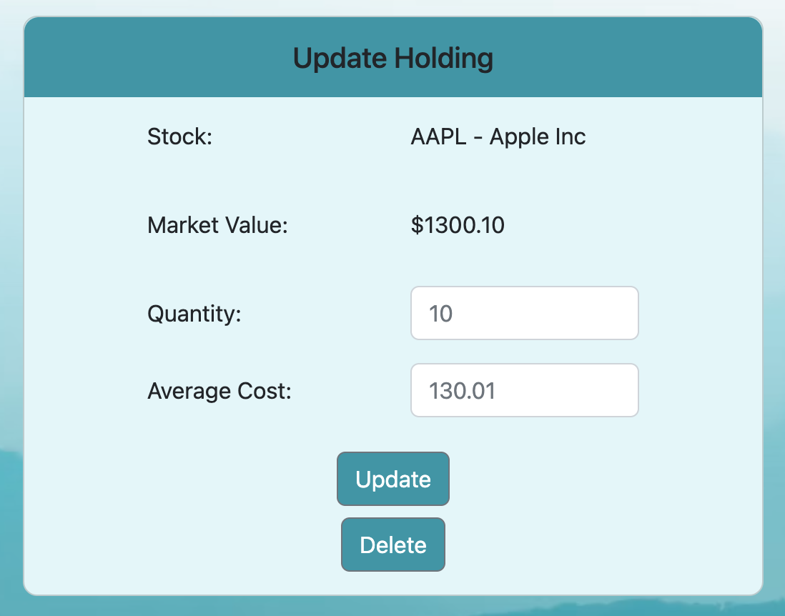

# Stockfolio

Welcome to your stock portfolio app! Here you can create multiple portfolios and view, add and remove individual holdings to see how your portfolio is performing.

## Getting Started

https://stockfolio-m4eh.onrender.com

## Technologies Used

- HTML
- CSS
- JavaScript
- NodeJS
- ExpressJS
- MongoDB
- Mongoose
- Bootstrap

## Next Steps

- Add search bar to add holdings form to search for stocks by symbol or name
- Pie Chart to visually display holding percentages
- Allow user to add buy/sell transactions for each holding
- Display Realized Gain/Loss in dashboard
- Update prices daily
